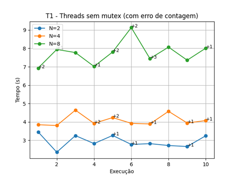
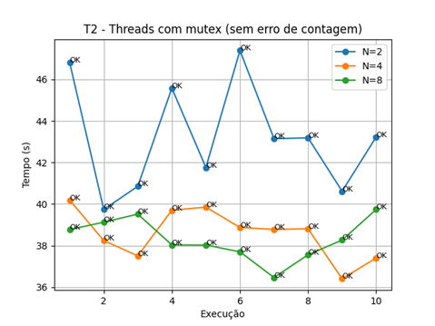
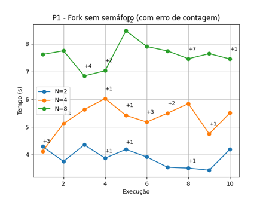
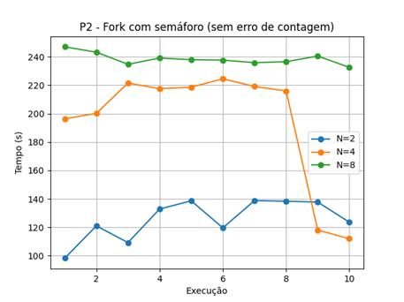

# Relatório - SISOP
Fabrine Machado e Vitor Rafael Borges

## 1. Introdução

Escrever algo

## 2. Análise

### T1 (Threads sem mutex)

ESCREVER ALGO

---

### T2 (Threads com mutex)

ESCREVER ALGO

---

### P1 (Fork sem semáforo)

ESCREVER ALGO

---

### P2 (Fork com semáforo)

---

## 3. Resultados

### Rafael

#### LSCPU
## Assinatura do Hardware

```
Architecture:             x86_64
CPU op-mode(s):           32-bit, 64-bit
Address sizes:            39 bits physical, 48 bits virtual
Byte Order:               Little Endian

CPU(s):                   4
On-line CPU(s) list:      0-3

Vendor ID:                GenuineIntel
Model name:               Intel(R) Core(TM) i5-4570 CPU @ 3.20GHz
CPU family:               6
Model:                    60
Stepping:                 3

Thread(s) per core:       1
Core(s) per socket:       4
Socket(s):                1

BogoMIPS:                 6385.22

Flags:
fpu vme de pse tsc msr pae mce cx8 apic sep mtrr pge mca cmov pat pse36 clflush
mmx fxsr sse sse2 ss ht syscall nx pdpe1gb rdtscp lm constant_tsc arch_perfmon
rep_good nopl xtopology cpuid tsc_known_freq pni pclmulqdq ssse3 fma cx16 pdcm
pcid sse4_1 sse4_2 movbe popcnt aes xsave avx f16c rdrand hypervisor lahf_lm abm
pti ssbd ibrs ibpb stibp fsgsbase bmi1 avx2 smep bmi2 erms invpcid xsaveopt
md_clear flush_l1d arch_capabilities

Virtualization features:
Hypervisor vendor:        Microsoft
Virtualization type:      full

Caches (sum of all):
L1d:                      128 KiB (4 instances)
L1i:                      128 KiB (4 instances)
L2:                       1 MiB (4 instances)
L3:                       6 MiB (1 instance)

NUMA:
NUMA node(s):             1
NUMA node0 CPU(s):        0-3

Vulnerabilities:
Gather data sampling:     Not affected
Itlb multihit:            KVM: Mitigation: VMX unsupported
L1tf:                     Mitigation; PTE Inversion
Mds:                      Mitigation; Clear CPU buffers; SMT Host state unknown
Meltdown:                 Mitigation; PTI
Mmio stale data:          Unknown: No mitigations
Reg file data sampling:   Not affected
Retbleed:                 Not affected
Spec rstack overflow:     Not affected
Spec store bypass:        Mitigation; Speculative Store Bypass disabled via prctl
Spectre v1:               Mitigation; usercopy/swapgs barriers and __user pointer sanitization
Spectre v2:               Mitigation; Retpolines; IBPB conditional; IBRS_FW; STIBP disabled; RSB filling; PBRSB-eIBRS Not affected; BHI Retpoline
Srbds:                    Unknown: Dependent on hypervisor status
Tsx async abort:          Not affected
```

#### T1 — Threads sem mutex (com erro de contagem)

Com o número de threads utilizados os tempo de execução sobe consistentemente. Também percebemos que há valores errados (aqui marcados com +1 a +3 para valores a mais do valor esperado).  


---

#### T2 — Threads com mutex

Todos os valores terminando em 1000000000 corretamente, entre 2 e 4 threads o tempo de execução é similar, mas com 8 threads é consistentemente alto.


---

#### P1 — Fork sem semáforo (com erro de contagem)
Consistentemente, o tempo de execução fica maior com mais forks(). Também percebemos que há valores errados (aqui marcados com +1 a +7 para valores a mais do valor esperado).  


---

#### P2 — Fork com semáforo

Todos os valores terminando em 1000000000 corretamente, observação interessante em dois testes com 4 forks() sendo mais velozes que 2 forks().


---

### Fabrine

#### LSCPU

#### T1 — Threads sem mutex (com erro de contagem)


---

#### T2 — Threads com mutex


---

#### P1 — Fork sem semáforo (com erro de contagem)


---

#### P2 — Fork com semáforo


---

## 6. Conclusão